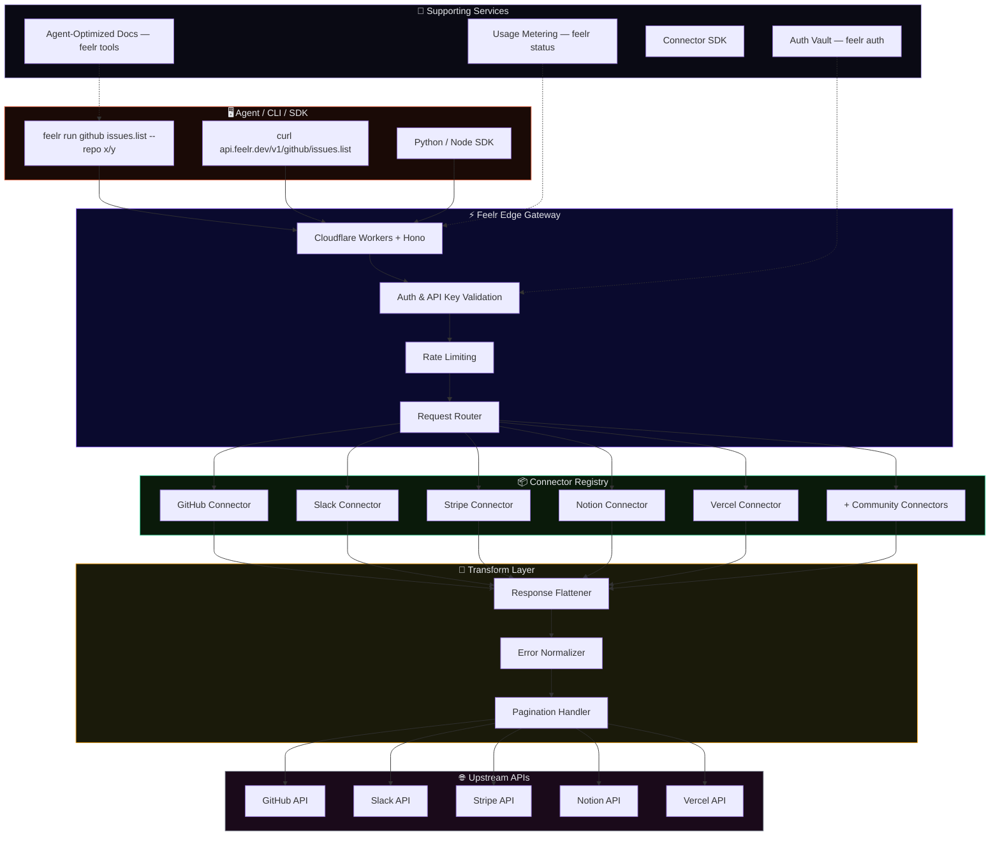
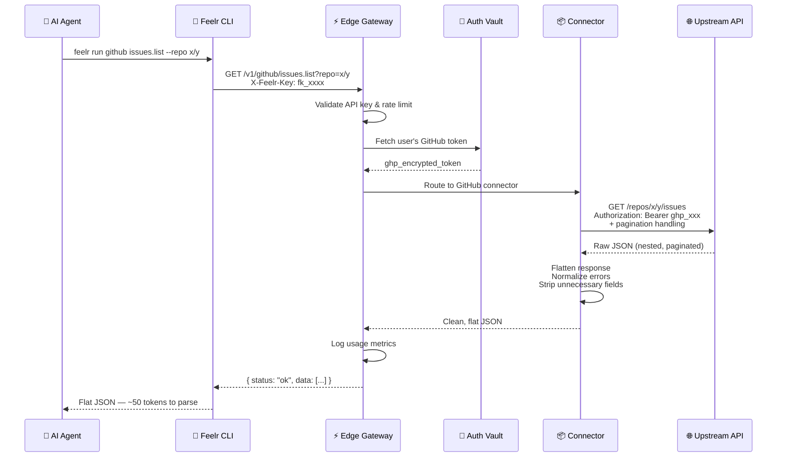
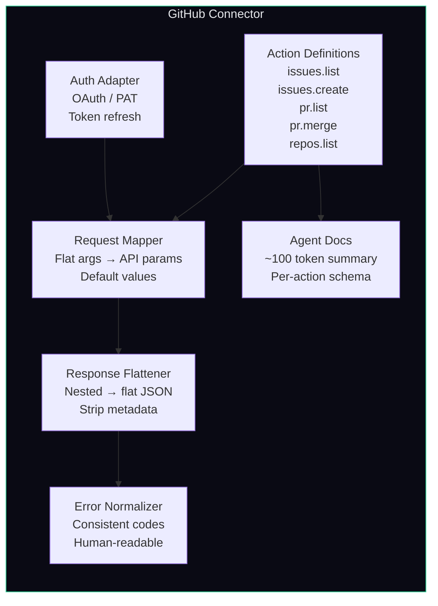
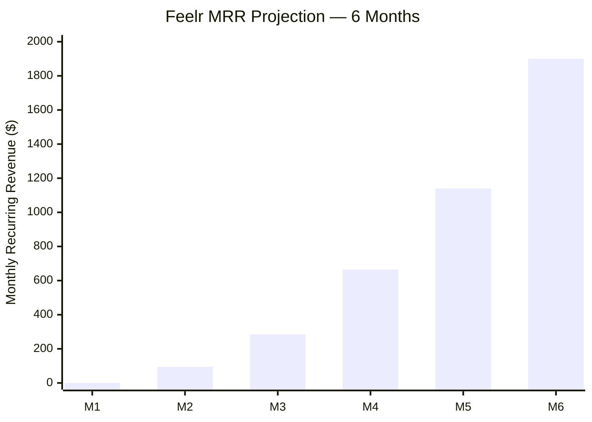
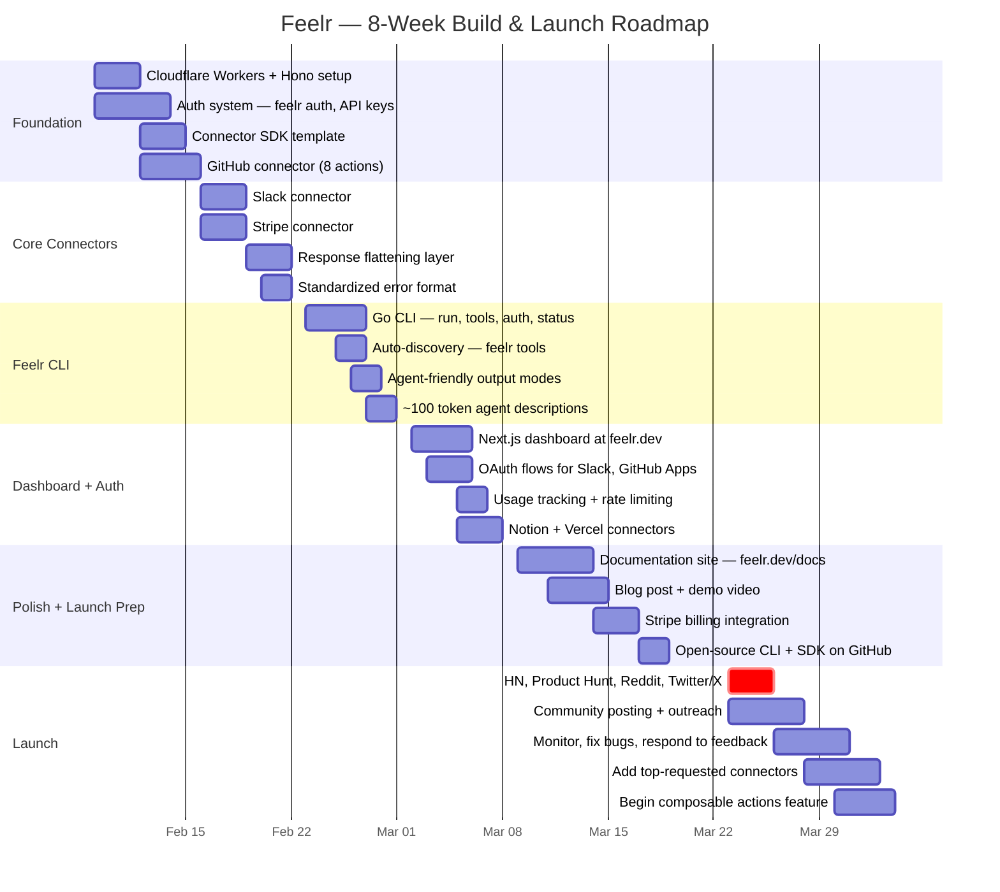
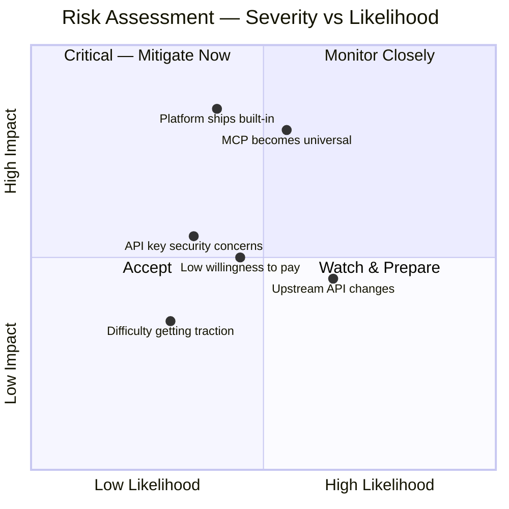

# 🦞 Feelr — Strategy Document

> **Agents sense. Agents act.**
>
> Lightweight API simplification layer for AI agent consumption.

**Version:** 0.2 · **Date:** February 2026 · **Status:** Pre-build Strategy

---

## Table of Contents

1. [Brand Identity](#1-brand-identity)
2. [Core Thesis](#2-core-thesis)
3. [The Problem](#3-the-problem)
4. [Product Definition](#4-product-definition)
5. [Technical Architecture](#5-technical-architecture)
6. [Market & Competition](#6-market--competition)
7. [Pricing Strategy](#7-pricing-strategy)
8. [Go-To-Market](#8-go-to-market)
9. [Roadmap](#9-roadmap)
10. [Risks & Mitigations](#10-risks--mitigations)

---

## 1. Brand Identity

### Why "Feelr"?

A lobster's antennae — its "feelers" — are how it senses, discovers, and navigates the world around it. **Feelr** does the same for AI agents: it lets them sense and discover API capabilities instantly, without wading through documentation or heavy protocol overhead.

### Name Properties

- **CLI-native:** Short, memorable, fast to type — `feelr run`, `feelr tools`, `feelr auth`
- **Brand vibe:** Modern, slightly playful, developer-friendly
- **Metaphor alignment:** Antennae = sensing = API discovery = lightweight probing

### CLI Branding

```
$ feelr

  🦞 feelr v0.1.0 — Agents sense. Agents act.

  USAGE
    feelr <command> [options]

  COMMANDS
    run      <connector> <action>    Execute an API action
    tools    [connector]             List available tools & actions
    auth     <connector>             Set up authentication
    status                           Check connector health
    config                           Manage Feelr settings

  EXAMPLES
    feelr run github issues.list --repo owner/repo
    feelr run slack message.send --channel general --text "Deploy complete"
    feelr run stripe customers.list --limit 10
    feelr tools github
    feelr auth slack

  DOCS  https://feelr.dev/docs
  KEYS  https://feelr.dev/dashboard
```

### Brand Colors

| Name            | Hex       | Usage              |
| --------------- | --------- | ------------------ |
| Lobster Red     | `#E85D3A` | Primary / Logo     |
| Antenna Purple  | `#8B5CF6` | Accent / Interactive |
| Tip Glow        | `#C4B5FD` | Highlights         |
| Signal Green    | `#34D399` | Success / Active   |
| Deep Sea        | `#0a0a14` | Backgrounds        |
| Shell           | `#1a1a2e` | Cards / Borders    |

### Typography

- **Headings & brand:** Space Grotesk
- **Code, CLI, technical:** JetBrains Mono
- **Body text:** Inter

### Domains & Handles

| Asset         | Value                     | Notes                          |
| ------------- | ------------------------- | ------------------------------ |
| Primary Domain | `feelr.dev`              | .dev is perfect for dev tools  |
| Alt Domain    | `getfeelr.com`            | Backup / marketing             |
| npm Package   | `@feelr/cli`              | `npm install -g @feelr/cli`    |
| GitHub        | `github.com/feelr-dev`    | Open-source CLI + SDK          |
| Twitter/X     | `@feelr_dev`              | Dev community presence         |
| API Endpoint  | `api.feelr.dev`           | Hosted service endpoint        |

---

## 2. Core Thesis

### The Problem in One Sentence

> AI agents waste 30–60% of their context window just understanding *how* to call APIs. MCP servers are powerful but heavy, and raw API calls require too much schema parsing. **There's a missing middle layer.**

### What Feelr Is

**Feelr** is an **Agent-Friendly API Simplification Layer** — a hosted service that sits between complex real-world APIs and AI agents/CLIs. It transforms bloated, poorly-documented APIs into minimal, predictable, CLI-native endpoints that agents can call with near-zero context overhead.

Like a lobster's antennae — it senses the API landscape so your agent doesn't have to.

### What Feelr Is NOT

- Not another API gateway (Kong, Apigee, Tyk)
- Not an MCP server marketplace
- Not a no-code integration platform (Zapier, Make)
- Feelr is specifically optimized for **agent consumption with minimal context**

### Why Now?

**🚀 Agent Explosion** — Claude Code, Codex CLI, Gemini CLI, Aider, Cline — every developer is running agents in terminals now. They all need to call external APIs.

**😤 MCP Fatigue** — MCP is powerful but heavy. Each server requires setup, config, and dumps tool schemas into context. 30+ tools = context bloat. Developers want something lighter.

**🎯 Context Is Currency** — Every token spent parsing an API spec is a token NOT spent on reasoning. With 200K context windows, this matters enormously for complex tasks.

**🔧 CLI-First World** — The agentic coding world runs on bash. If your agent can just run `feelr run` or pipe to a simple CLI, it doesn't need MCP config, server processes, or JSON-RPC.

---

## 3. The Problem

### Pain Point: Raw API Calls

An agent trying to use the GitHub API needs to: understand OAuth flows, parse 500+ endpoints from the OpenAPI spec, construct proper headers, handle pagination, manage rate limits, and parse nested response objects. That's thousands of tokens just to make one call.

### MCP Helps... But Adds Its Own Problems

MCP servers abstract away HTTP details, but they introduce: server process management, JSON-RPC protocol overhead, tool schema definitions that eat context (a typical MCP server dumps 2–5K tokens of tool descriptions), configuration per environment, and the need for the agent's host to support MCP. A CLI agent running in a bash session can't easily use MCP.

### Feelr: The Missing Middle

A hosted API that pre-digests complex APIs into dead-simple, flat endpoints. An agent just needs to know: the command name, 1–3 arguments, and what comes back. Total context needed: **50–100 tokens** instead of 2,000–5,000.

### Target Users

**Solo Developers with Agents** — Running Claude Code, Aider, or custom agents. Want their agents to interact with GitHub, Stripe, Slack, etc. without writing wrapper code every time. Tired of boilerplate API wrappers, find MCP setup overkill for simple tasks, want agents to "just work" with external services.

**Agent Framework Builders** — Building tools on top of LangChain, CrewAI, AutoGen, etc. Need a fast way to give agents access to real-world services. Need reliable, pre-built tool integrations. Don't want to maintain 50 MCP servers.

**AI-Powered Automation Builders** — Building internal tools, workflows, and automations that use AI agents. Need them to talk to their existing software stack. Complex auth flows for every API, agents hallucinate API parameters, need predictable and typed responses.

---

## 4. Product Definition

Feelr is a hosted service + CLI tool that makes any complex API callable in one line. Designed specifically for AI agent consumption with minimal context requirements.

### How It Works

```bash
# Instead of this (raw API — needs auth, headers, pagination):
curl -H "Authorization: Bearer ghp_xxxx" \
  -H "Accept: application/vnd.github+json" \
  "https://api.github.com/repos/owner/repo/issues?state=open&per_page=30"

# Or this (MCP — needs server running, JSON-RPC, tool schemas):
# → Start MCP server, configure JSON-RPC, load 15 tool schemas...

# With Feelr, your agent just does:
feelr run github issues.list --repo owner/repo --state open

# Or via HTTP:
curl https://api.feelr.dev/v1/github/issues.list?repo=owner/repo&state=open \
  -H "X-Feelr-Key: fk_xxxx"

# Response: Clean, flat JSON — no nested objects, no pagination tokens
# Context cost: ~50 tokens vs ~3,000 for raw API understanding
```

### Core Features

**🔌 Pre-Built Connectors** — Start with 10–20 popular APIs: GitHub, Stripe, Slack, Linear, Notion, Vercel, Cloudflare, Supabase, Resend, Twilio. Each connector exposes 5–15 simplified actions.

**📋 Flat Response Format** — Every response is flat JSON with consistent structure. No nested objects, no pagination tokens to manage, no inconsistent error formats. Agents parse it instantly.

**🔑 One-Time Auth Setup** — User connects their API keys once via dashboard or `feelr auth`. Agent calls use a single Feelr key. No OAuth flows, no token refresh — Feelr handles all of that.

**📖 Agent-Optimized Docs** — Each connector has a ~100 token description an agent can ingest. Compare to 5,000+ tokens for a typical OpenAPI spec. Run `feelr tools github` for a compact overview.

**⚡ CLI + HTTP + SDK** — Works as a CLI tool (`feelr run`), a REST API (curl-friendly), or via lightweight Python/Node SDKs. Agents pick whatever fits their environment.

**🧩 Composable Actions** — Chain multiple API calls into a single action. "Deploy" could mean: push to GitHub → trigger Vercel build → post to Slack. One `feelr run` call, multiple APIs.

### Agent Context Comparison

| Dimension              | Feelr              | MCP Server            | Raw API + OpenAPI      |
| ---------------------- | ------------------ | --------------------- | ---------------------- |
| Context tokens needed  | **50–100**         | 2,000–5,000           | 5,000–15,000           |
| Setup time             | 2 min (install CLI)| 10–30 min per server  | Hours of wrapper code  |
| Auth handling          | One key, we handle it | Per-server config  | Manual per API         |
| Works in bash?         | ✅ Native CLI      | ❌ Needs MCP host     | ✅ But complex         |
| Response format        | Flat, consistent   | Varies by server      | Varies wildly          |
| Error handling         | Standardized codes | Varies                | API-specific           |
| Multi-API chains       | ✅ Composable      | ❌ One server = one API | ❌ Manual orchestration |

---

## 5. Technical Architecture

### High-Level Architecture



### Request Flow (Sequence)



### Connector Internals



### Tech Stack

| Layer             | Technology                    | Why                                                        | Est. Cost   |
| ----------------- | ----------------------------- | ---------------------------------------------------------- | ----------- |
| Edge / Gateway    | Cloudflare Workers + Hono     | Zero cold starts, global edge, ~$5/mo at scale. KV for caching. | $0–5/mo     |
| Connector Runtime | TypeScript / Bun              | Fast, type-safe. Each connector is self-contained. Easy for community contributions. | $0          |
| Auth Vault        | Cloudflare Workers KV + encryption | Encrypted at rest. Users run `feelr auth` once. Feelr manages refresh tokens, OAuth flows. | $0–5/mo     |
| CLI Tool          | Go or Rust binary             | Single binary, no runtime deps. Agents shell out instantly. Cross-platform. | $0          |
| Usage / Billing   | Stripe Billing + custom metering | Usage-based billing with Stripe's metered subscriptions. Track calls per connector. | 2.9% + fees |
| Dashboard         | Next.js on Vercel             | Simple UI at feelr.dev for key mgmt, connector setup, usage stats. | $0          |

**Total MVP infrastructure cost: $10–30/month.** At 100 paying users: still under $100/month. Cloudflare Workers offers 100K requests/day on the free tier, $5/month for 10M requests.

---

## 6. Market & Competition

### Competitive Landscape

| Competitor                  | Type                  | Threat        | Feelr's Position                                                                 |
| --------------------------- | --------------------- | ------------- | -------------------------------------------------------------------------------- |
| **MCP Servers**             | Protocol              | Medium        | Powerful but heavy. Feelr is the lightweight alternative for CLI-first workflows. Complementary — could offer MCP-compatible mode later. |
| **Kong / Apigee / Tyk**    | Enterprise API Gateway| Low           | Enterprise-focused, complex, expensive. Not targeting solo devs or AI agents.    |
| **Eden AI / Merge.dev**     | API Aggregator        | Medium        | Eden AI unifies AI model APIs. Merge.dev unifies SaaS APIs. Neither targets agent consumption with context optimization. |
| **mcp-cli (Philipp Schmid)**| CLI for MCP           | Medium-High   | Solves context bloat for MCP with dynamic discovery. Feelr goes further: no MCP needed at all, simpler mental model, managed auth, composable actions. |
| **Zapier / Make**           | No-code Automation    | Low           | Trigger-based automation for non-developers. Not usable from CLI or by agents.   |
| **DIY Wrappers**            | Custom Code           | **High**      | Feelr's real competitor. Developers writing their own API wrappers. Feelr wins by being faster, maintained, and consistent across APIs. |

---

## 7. Pricing Strategy

Hybrid model: generous free tier to drive adoption, usage-based scaling, and a flat pro tier for predictability. Agent API calls are high-frequency but low-cost to serve.

### Tiers

| Tier            | Price          | Included                                                                |
| --------------- | -------------- | ----------------------------------------------------------------------- |
| **Hatchling**   | $0/forever     | 1,000 API calls/mo · 5 connectors · CLI + HTTP · Community support · Agent-optimized docs |
| **Lobster**     | $19/month      | 50,000 API calls/mo · All connectors · Composable actions · Priority support · Team keys · Usage dashboard |
| **Leviathan**   | $49/month      | 500,000 API calls/mo · Custom connectors · SLA guarantee · Dedicated support · Webhook callbacks · Audit logs |
| **Metered**     | $0.001/call    | Pay-per-use after plan quota · On top of any plan · Volume discounts at 1M+ · Real-time billing |

### Revenue Projections (Conservative)

| Month | Free Users | Paid Users | MRR     | Notes                 |
| ----- | ---------- | ---------- | ------- | --------------------- |
| M1    | 50         | 0          | $0      | Launch + awareness    |
| M2    | 200        | 5          | $95     | First conversions     |
| M3    | 500        | 15         | $285    | Content marketing     |
| M4    | 1,000      | 35         | $665    | Word of mouth         |
| M5    | 2,000      | 60         | $1,140  | Framework partnerships|
| M6    | 3,000      | 100        | $1,900  | Product-market fit    |

### Revenue Growth Projection



---

## 8. Go-To-Market

### GTM Strategy Flow

```mermaid
graph LR
    subgraph Phase1["Phase 1: Developer Hooks — Weeks 1–4"]
        OS["Open-source Feelr CLI"]
        C5["Ship 5 connectors:<br/>GitHub, Slack, Stripe,<br/>Notion, Vercel"]
        LAUNCH["Post on HN, Reddit,<br/>Twitter/X dev community"]
    end

    subgraph Phase2["Phase 2: Content + Community — Months 2–3"]
        BLOG["Write tutorials:<br/>'Give Claude Code Stripe<br/>powers in 30 seconds'"]
        VIDEO["Record demo videos"]
        DISC["Build Discord community"]
        CONTRIB["Accept connector<br/>contributions"]
    end

    subgraph Phase3["Phase 3: Expand + Monetize — Months 3–6"]
        CONN["Add 20+ connectors"]
        PAID["Launch paid tier"]
        COMP["Introduce composable<br/>actions"]
        TEAM["Offer team plans"]
        PARTNER["Partner with agent<br/>framework companies"]
    end

    Phase1 --> Phase2 --> Phase3

    style Phase1 fill:#1a0a06,stroke:#E85D3A,color:#E5E7EB
    style Phase2 fill:#0a1a0a,stroke:#10B981,color:#E5E7EB
    style Phase3 fill:#1a1a0a,stroke:#F59E0B,color:#E5E7EB
```



**Phase 1 — Developer Hooks (Weeks 1–4):** Open-source the Feelr CLI. Ship 5 popular connectors (GitHub, Slack, Stripe, Notion, Vercel). Post on Hacker News, Reddit r/programming, Twitter/X dev community. The CLI is free — the hosted service at api.feelr.dev is what you monetize.

**Phase 2 — Content + Community (Months 2–3):** Write "Give your Claude Code agent Stripe powers in 30 seconds with Feelr" type posts. Create video demos. Build a Discord community. Accept connector contributions. Target agent framework communities (LangChain, CrewAI).

**Phase 3 — Expand + Monetize (Months 3–6):** Add 20+ connectors. Launch paid tier. Introduce composable actions (multi-API chains). Offer team plans. Potentially partner with agent framework companies for native Feelr integrations.

---

## 9. Roadmap

### 8-Week Build & Launch



### Week-by-Week Detail

**Week 1 — Foundation**
- Set up Cloudflare Workers project with Hono framework
- Build auth system (`feelr auth` — API key generation, encrypted vault for user tokens)
- Create connector SDK / template (TypeScript module structure)
- Build first connector: GitHub (issues, PRs, repos — 8 actions)

**Week 2 — Core Connectors**
- Build Slack connector (send message, list channels, search)
- Build Stripe connector (list payments, customers, create invoice)
- Build response flattening / normalization layer
- Standardized error format across all connectors

**Week 3 — Feelr CLI**
- Build CLI tool in Go — `feelr run`, `feelr tools`, `feelr auth`, `feelr status`
- Auto-discovery: `feelr tools` shows all connectors + actions
- Agent-friendly output: JSON, table, or minimal modes
- Write the ~100 token agent descriptions for each connector

**Week 4 — Dashboard + Auth**
- Build Next.js dashboard at feelr.dev (API key management, connector setup)
- OAuth flow for connectors that need it (Slack, GitHub Apps)
- Usage tracking + rate limiting
- Add 2 more connectors: Notion + Vercel

**Weeks 5–6 — Polish + Launch Prep**
- Documentation site at feelr.dev/docs with agent-optimized quick-start
- Blog post: "Give Your AI Agent Superpowers in 60 Seconds with Feelr"
- Record demo video showing Claude Code using `feelr run`
- Set up Stripe billing (Hatchling / Lobster / Leviathan tiers)
- Open-source the Feelr CLI + connector SDK on GitHub

**Weeks 7–8 — Launch + Iterate**
- Launch on Hacker News, Product Hunt, Reddit, Twitter/X
- Post in Claude Code, LangChain, CrewAI communities
- Monitor usage, fix bugs, respond to feedback
- Add top-requested connectors based on user feedback
- Begin composable actions feature (multi-API chains)

---

## 10. Risks & Mitigations

| Risk | Severity | Mitigation |
| ---- | -------- | ---------- |
| **MCP becomes the universal standard** and agents all support it natively | 🔴 High | Offer MCP-compatible mode alongside CLI/HTTP. Position Feelr as "MCP but lighter." Also offer value-add (composable actions, managed auth) that raw MCP doesn't. |
| **Major platform (Anthropic, OpenAI) ships this** as a built-in feature | 🔴 High | Move fast, build community, establish connector ecosystem. Even if platforms add basic support, Feelr with 50+ connectors wins on breadth and quality. Platforms won't support every niche API. |
| **Security concerns** around storing third-party API keys | 🟡 Medium | SOC2-style security from day one. Encryption at rest/transit. Offer self-hosted option. `feelr auth` can also accept per-call keys if users don't want vault storage. |
| **Low willingness to pay** for API wrappers | 🟡 Medium | Free tier drives adoption. Revenue comes from power users making 50K+ calls/month. Metered pricing ensures you never lose money on a user. |
| **Upstream APIs change** and break connectors | 🟡 Medium | Automated testing against live APIs. `feelr status` shows connector health. Community contributions for maintenance. Start with stable, well-documented APIs. |
| **Difficulty getting initial traction** | 🟢 Low | Open-source CLI is the trojan horse. Free tier is generous. Content marketing drives organic discovery. Agent framework integrations give immediate distribution. The lobster brand is memorable and shareable. |

### Risk Landscape



---

## Key Decisions to Make Before Building

| Decision | Options |
| -------- | ------- |
| **CLI language?** | Go (fast, single binary) vs Rust (faster, harder to write) vs Node (easier, needs runtime) |
| **First 5 connectors?** | GitHub + Slack + Stripe are obvious. #4 and #5: Notion? Vercel? Linear? Supabase? |
| **Open-source strategy?** | Fully open CLI + SDK? Open CLI, closed hosted service? Fully open with managed cloud offering? |
| **Domain availability?** | Check feelr.dev, getfeelr.com, feelr.sh — secure before announcing |
| **Initial launch channel?** | Hacker News first? Product Hunt first? Twitter/X build-in-public thread? |

---

*🦞 Feelr — Agents sense. Agents act.*

*Strategy document v0.2 · February 2026*
